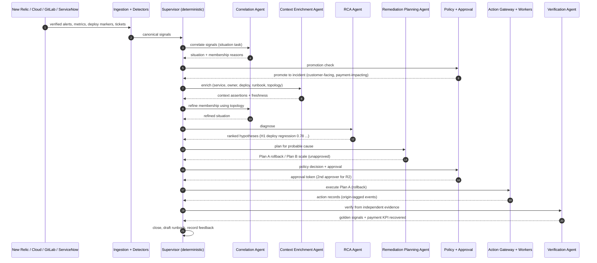

# Agent Orchestration

## Purpose

This document maps the specialized agents onto every step of the self-healing automation, for both target use cases:

- **UC1 — Self-Healing IT Systems** (customer digital and application estate; New Relic-driven).
- **UC2 — Agent Observability and Security** (customer-facing GenAI assistant; MLflow-driven).

It is the runtime companion to `agent-system.md` (roles) and `agent-contracts.md` (typed I/O). It shows *which agent owns which phase, what it consumes and returns, which registry entries bind it, and where deterministic control takes over from probabilistic reasoning*.

## Design stance (unchanged from ADR-001)

The customer architecture (see the shared agent diagram) shows four agents behind a *Self-healing Backend Integration and Orchestration Layer* plus Agent, Skills, and BPMN registries. We preserve that shape and make three deliberate improvements:

1. **The orchestration layer is deterministic, not an agent.** The Supervisor/Orchestrator owns the incident state machine, routing, budgets, and persistence. It is code, not a model. Agents receive typed task snapshots and return typed proposals.
2. **The customer's single "Remediation Agent" is split.** A **Remediation Planning Agent** (reasoning, *no* mutating access) produces plans; **deterministic Action Workers** behind the **Action Gateway** execute them. No reasoning agent ever mutates a production system.
3. **Two agents are added for UC2** — an **Agent Observability Agent** and an **Agent Security Agent** — so the same correlate → diagnose → plan → verify spine can be pointed at the AI agents themselves.

## Agent Roster

Reasoning agents (behind the deterministic Supervisor; all stateless task handlers returning proposals):

| Agent | Origin | Mandate | Mutating access | Primary use case |
|---|---|---|---|---|
| Correlation Agent | Customer | Group related signals into situations; explain membership | None | UC1 + UC2 |
| Context Enrichment Agent | Customer | Gather service, topology, change, version, knowledge, and history context | None | UC1 + UC2 |
| RCA Agent | Customer | Produce ranked, testable, evidence-backed hypotheses | None | UC1 + UC2 |
| Remediation Planning Agent | Customer (split) | Build an executable but unapproved plan from registered actions | None | UC1 + UC2 |
| Verification Agent | Improvised (specs) | Assess outcome and unintended impact from independent evidence | Read-only | UC1 + UC2 |
| Agent Observability Agent | Improvised (UC2) | Analyze MLflow traces and evaluation metrics; detect quality drift, groundedness regression, cost/latency anomalies | None | UC2 |
| Agent Security Agent | Improvised (UC2) | Triage injection, jailbreak, PII-leakage, and anomalous-tool-call detector output into security findings | None | UC2 |

Deterministic components (not agents):

| Component | Responsibility |
|---|---|
| Supervisor / Orchestrator | Incident state machine, routing, budgets, persistence, handoffs |
| Policy & Approval Engine | Deterministic policy decision + approval-token binding |
| Action Gateway + Action Workers | The only production-mutating path; idempotency, preconditions, audit |
| Detector skills | Injection/jailbreak, PII/exfiltration, anomaly, and evaluation harnesses (deterministic + judge models), invoked as skills |

## Registries and Runtime Binding

The customer's three registries are retained as three facets of one versioned registry model:

| Registry | Holds | Used by the Supervisor to… |
|---|---|---|
| **Agent Registry** | Agent identity, version, contract schema, eval status, deployment status, autonomy eligibility | Select the correct agent version for a task; reject agents not passing eval gates |
| **Skills Registry** | Tools/skills: read-only vs mutating, input/output schemas, target systems, required identity, idempotency, rate limits, side effects | Assemble the **tool allowlist** handed to an agent; enforce that agents cannot self-grant tools |
| **BPMN / Workflow Registry** | Workflow definitions (BPMN, declarative state machines, or job graphs) per use case and incident class | Drive the phase sequence and the failure/rollback routing for each incident class |

At the start of each phase the Supervisor resolves `(incident class, phase) → workflow step → agent version + skill allowlist + budgets`, hands the agent an immutable task snapshot, and validates the returned proposal before persisting it. Retrieved content and tool output are untrusted and cannot redefine instructions, tools, or schemas.

## Canonical Automation Pipeline

The same nine phases run for both use cases; the agents and evidence sources differ. State names refer to the incident state machine in `architecture/01-reference-architecture.md`.

| # | Phase (state) | Owner | Output & handoff |
|---|---|---|---|
| 0 | Intake & detection | Deterministic ingestion + detector skills | Canonical signals → **Situation** |
| 1 | Correlation | Correlation Agent | Situation membership + reasons |
| 2 | Promotion (`Detected`) | Policy Engine (deterministic) | Situation → **Incident** (or `Suppressed`) |
| 3 | Enrichment (`Enriching`) | Context Enrichment Agent | Context assertions with source/freshness |
| 4 | Correlation refinement (`Correlating`) | Correlation Agent | Membership refined using enriched topology |
| 5 | Diagnosis (`Diagnosing`) | RCA Agent (+ UC2 specialist agents) | Ranked hypotheses + evidence |
| 6 | Planning (`Planning`) | Remediation Planning Agent | Plan candidates (unapproved) |
| 7 | Policy & approval (`AwaitingApproval`) | Policy Engine + human | Bound approval token (or `Escalated`) |
| 8 | Execution (`Executing`) | Action Workers via Gateway | Action records + origin-tagged events |
| 9 | Verification (`Verifying`) → closure (`Resolved`) | Verification Agent (+ UC2 specialist) | Verified outcome + draft knowledge + feedback labels |

The Supervisor enforces per-phase iteration, tool, token, and time budgets. Budget exhaustion in any agent phase yields a classified `inconclusive` result and escalation (`NFR-CST-004`) — never a truncated conclusion or expanded authority.

---

## UC1 — Self-Healing IT Systems: Orchestration

### Sequence



### Per-agent responsibilities in UC1

| Phase | Agent / component | What it does in UC1 | Key skills (read-only unless noted) | Guardrail |
|---|---|---|---|---|
| Intake | Ingestion + detectors | Normalize verified New Relic alerts, APM/infra metrics, synthetics, deploy markers, ServiceNow tickets | `newrelic.nrql`, `cloud.health`, `servicenow.query` | Only `signature_status=verified` events justify later actions (`FR-TEL-007`) |
| Correlation | **Correlation Agent** | Group the app degradation, payment failures, deploy, and New Relic incident into one situation; separate surge noise | `topology.read`, `similarity.search` | Cannot suppress source records or change severity without an explicit proposal |
| Promotion | Policy Engine | Promote using criticality (customer-facing, payment, peak-demand) per `FR-COR-006` | — | Deterministic; preserves situation id |
| Enrichment | **Context Enrichment Agent** | Attach service owner, criticality, the GitLab deploy (diff snapshot), maintenance windows, runbook, prior surge incidents | `servicenow.cmdb`, `gitlab.deploy`, `confluence.runbook`, `newrelic.entitymap` | Records source conflicts; returns no secrets |
| Correlation refinement | **Correlation Agent** | Re-check membership using enriched dependency topology | `topology.read` | Conflicts retained, not overwritten |
| Diagnosis | **RCA Agent** | Rank hypotheses: deploy regression (probable) > surge amplification (contributing) > payment provider (alternative); attach supporting/contradicting evidence and tests | `newrelic.nrql`, `gitlab.diff`, `metrics.compare` | Every hypothesis cites evidence; alternative required for high severity |
| Planning | **Remediation Planning Agent** | Produce Plan A (rollback) and Plan B (scale + pool bump) with blast radius, verification queries, rollback triggers, expiry | Reads Skills Registry action catalog only | May not call mutating tools or invent unregistered actions |
| Policy & approval | Policy Engine + human | Evaluate identity/env/service/risk/window/confidence/evidence; require A3 + second approver for payment-impacting R2 | — | Confidence never grants authority |
| Execution | Action Gateway + **Workers** | Validate token + fresh precondition (bad deploy still active), execute GitLab rollback with idempotency, emit origin-tagged events | `gitlab.rollback` (mutating), `cloud.scale` (mutating) | Fail closed; reconcile `unknown_result` before retry (`FR-ACT-008`) |
| Verification | **Verification Agent** | Confirm from independent evidence: golden signals recover, synthetics pass, payment success restored, tickets subside | `newrelic.nrql`, `synthetics.status`, `payments.kpi` | Must not rely on the rollback API response |
| Closure | Supervisor | Record cause disposition, outcome, residual risk, follow-up; draft runbook (unpublished); label feedback | — | Draft knowledge not auto-published (`FR-KNW-003`) |

---

## UC2 — Agent Observability and Security: Orchestration

The same spine is pointed at the monitored GenAI assistant. Two improvised agents act as specialized analysts feeding the shared Correlation and RCA agents.

### Sequence (security hero path + quality-drift path)

```mermaid
sequenceDiagram
  autonumber
  participant AG as Monitored Assistant + Gateway
  participant ML as MLflow Traces + Eval + Detectors
  participant SUP as Supervisor (deterministic)
  participant SEC as Agent Security Agent
  participant OBS as Agent Observability Agent
  participant COR as Correlation Agent
  participant CTX as Context Enrichment Agent
  participant RCA as RCA Agent
  participant PLN as Remediation Planning Agent
  participant POL as Policy + Approval
  participant GW as Action Workers (policy, serving, Lakewatch, ServiceNow)
  participant VER as Verification Agent

  AG->>ML: traces, tool-call attempts, retrieved context
  ML->>SUP: injection flag + anomalous tool calls (credit>cap, cross-account read)
  Note over AG,GW: Gateway already DENIED both calls; nothing executed
  SUP->>SEC: triage security signals
  SEC-->>SUP: confirmed injection finding + affected session/scope
  SUP->>COR: correlate related sessions/metrics
  COR-->>SUP: situation (session cluster / violation spike)
  SUP->>CTX: enrich (agent/prompt/model/policy versions, tool scope, retrieval sources)
  CTX-->>SUP: version + scope context
  SUP->>RCA: diagnose
  RCA-->>SUP: cause = injection exploiting over-broad credit tool + retrieval surface
  SUP->>PLN: plan containment + fix
  PLN-->>SUP: lower cap / tighten scope / patch prompt / add eval case / scan index
  SUP->>POL: policy decision (registry + policy changes = SoD)
  POL-->>SUP: approvals recorded
  SUP->>GW: apply governed changes; open Lakewatch finding + ServiceNow case
  GW-->>SUP: action records
  SUP->>VER: verify
  VER-->>SUP: regression eval blocks attack; 0 unauthorized actions; 0 PII egress
  Note over ML,OBS: Parallel slow path
  ML->>SUP: groundedness drop + cost spike after agent v1.4
  SUP->>OBS: analyze drift
  OBS-->>SUP: quality regression localized to v1.4 prompt change
  SUP->>PLN: plan version rollback via eval gate
```

### Per-agent responsibilities in UC2

| Phase | Agent / component | What it does in UC2 | Key skills | Guardrail |
|---|---|---|---|---|
| Intake | MLflow + detector skills | Trace every interaction; run injection/jailbreak, PII/exfiltration, anomaly, and evaluation detectors | `mlflow.trace`, `injection.detect`, `pii.detect`, `eval.run` | Tool calls are already denied at the gateway; detection is for incident-raising, not for blocking (blocking is deterministic) |
| Detection triage | **Agent Security Agent** | Turn raw detector hits into a confirmed security finding: is this a real injection, what scope was targeted, which session/customer | `mlflow.trace`, `policy.read`, `session.read` | No mutating access; treats session content as untrusted (`NFR-SEC-007`) |
| Health analysis | **Agent Observability Agent** | Detect quality drift, groundedness regression, cost/latency anomalies across versions and segments | `mlflow.eval`, `inference.profile`, `cost.query` | Distinguishes acceptance from confirmed correctness (`NFR-QLT-006`) |
| Correlation | **Correlation Agent** | Group related sessions / a violation spike / a drift signal into one situation | `similarity.search`, `version.map` | Membership reasons recorded |
| Promotion | Policy Engine | Classify as **security incident** vs **quality-regression incident** | — | Distinct workflow per class (BPMN registry) |
| Enrichment | **Context Enrichment Agent** | Attach agent/prompt/model/policy versions, tool scope + caps, affected segment, recent agent deploy, retrieval sources | `agent.registry`, `skills.registry`, `search.index.meta` | Returns no PII values; uses classifications |
| Diagnosis | **RCA Agent** (assisted by SEC/OBS) | Security: injection exploiting over-broad credit tool + unsanitized retrieval. Quality: regression localized to v1.4 prompt change | `mlflow.trace`, `eval.compare`, `policy.diff` | Evidence-backed; inconclusive allowed |
| Planning | **Remediation Planning Agent** | Containment + fix: lower credit cap / tighten tool scope for unverified sessions, patch prompt separation, add attack to adversarial eval set, scan/rebuild knowledge index, or roll back agent version | Skills Registry only | No mutation; registry/policy edits proposed, not applied |
| Policy & approval | Policy Engine + human | Registry, policy, and agent-version changes pass the same release gates and **segregation of duties** (`FR-ADM-005`); authors cannot self-approve | — | Autonomy restored only by approval (`NFR-AUT-001`) |
| Execution | Action Workers | Apply governed policy/scope change; roll back agent version via serving; open **Lakewatch** finding + **ServiceNow** case; quarantine session | `policy.update` (mutating), `serving.rollback` (mutating), `lakewatch.finding` (mutating), `servicenow.case` (mutating) | Fail closed; full audit |
| Verification | **Verification Agent** (+ OBS) | Confirm: regression eval now blocks the attack; **0 unauthorized actions executed, 0 PII egress**; quality metrics recover on the restored version | `eval.run`, `audit.query`, `mlflow.eval` | Independent of the executor's own report |
| Closure | Supervisor | Record finding disposition, add adversarial case to the versioned eval set, update runbook, label feedback (tamper-evident, `NFR-SEC-009`) | — | Draft knowledge not auto-published |

---

## Cross-Cutting Orchestration Rules

- **Handoffs are deterministic.** Only the Supervisor advances state, on a validated proposal. An agent cannot advance the workflow, call another agent directly, or expand its own authority.
- **Parallelism with conflict retention.** In UC2 the Security and Observability agents may run in parallel with Correlation; conflicting conclusions are retained and surfaced, never silently merged.
- **Failure routing** (from the BPMN/workflow registry): agent timeout, malformed output, hallucinated evidence, or references to inaccessible evidence → the Supervisor records a classified failure and applies the deterministic fallback (retry with reduced scope, escalate, or park in `Escalated`). The default is to preserve evidence, mark uncertainty, and escalate — never to invent context or proceed with more authority.
- **Autonomy is gated per phase and per action class**, not per agent. A high-confidence RCA never authorizes execution; only a policy decision plus (where required) approval does.
- **Budgets and cost** are Supervisor-enforced per phase; exhaustion escalates (`NFR-CST-004`).
- **Every phase records** the agent, prompt, model, skill, policy, and workflow versions used, for audit replay against recorded I/O (`NFR-QLT-007`, `NFR-AUD-003`).

## Mapping Back to the Customer Diagram

| Customer element | This design |
|---|---|
| Correlation Agent | Correlation Agent (unchanged mandate) |
| Context Enrichment Agent | Context Enrichment Agent (unchanged mandate) |
| RCA Agent | RCA Agent (unchanged mandate) |
| Remediation Agent | Split into Remediation **Planning** Agent (reasoning) + deterministic **Action Workers** (execution) |
| Self-healing Backend Integration & Orchestration Layer | Deterministic Supervisor/Orchestrator + BFF + Action Gateway + Policy Engine |
| Agent Registry | Agent Registry facet |
| Skills Registry | Skills Registry facet (drives tool allowlists) |
| BPMN Registry | Workflow Registry facet (drives phase + failure routing) |
| — (added) | Agent Observability Agent, Agent Security Agent (UC2) |
