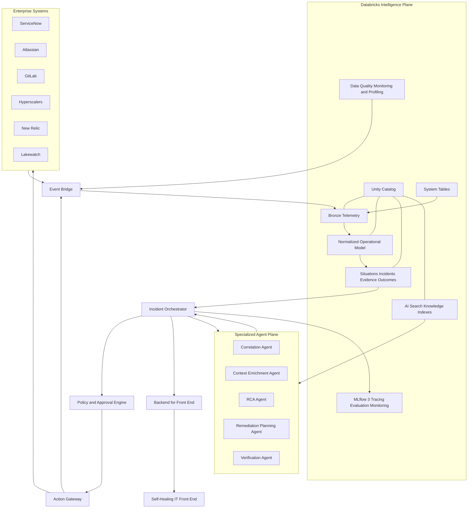
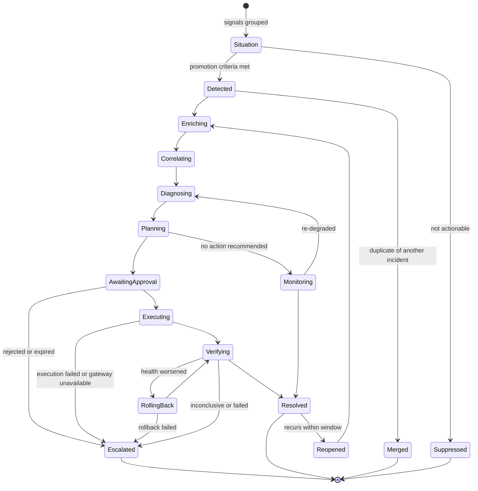

# Reference Architecture

## Logical Architecture

## Architectural Planes

### Experience plane

The front end displays situations, incident timelines, evidence, hypotheses, recommended plans, approvals, execution progress, verification, and audit history. Server-sent events are the default live-update mechanism. WebSockets may be introduced only where bidirectional low-latency interaction is required.

### Integration plane

The backend-for-front-end provides user-facing APIs. The event bridge receives source events and publishes normalized lifecycle events. Connectors translate source-specific formats into canonical contracts. The action gateway is the only component permitted to invoke production-mutating operations.

### Intelligence plane

Delta tables store immutable raw events, normalized entities, incident state, evidence links, agent outputs, policies, action records, and outcomes. Unity Catalog governs these assets. AI Search indexes approved operational knowledge. Data quality monitoring and data profiling measure source and derived dataset health.

### Agent plane

Specialized agents operate behind a supervisor/orchestrator. Agents are versioned components with typed input and output schemas, bounded tools, evaluation baselines, and explicit failure modes. Agents do not communicate through ungoverned free-form peer messaging.

### Control plane

The orchestrator enforces the incident state machine. The policy and approval engine evaluates identity, environment, service, action class, risk, maintenance window, confidence, and evidence completeness. Registries hold versioned metadata for agents, skills, workflows, prompts, policies, and schemas.

### Action plane

The action gateway validates approval tokens and execution preconditions, applies idempotency, invokes tools, captures raw results, and emits action events. Verification is performed independently from the executor whenever possible.

## Databricks Component Mapping

| Concern | Preferred capability |
|---|---|
| Governed telemetry and incident data | Delta Lake and Unity Catalog |
| Databricks operational telemetry | System tables and supported platform APIs |
| Security findings and SIEM workflows | Lakewatch integration boundary |
| Data and inference dataset health | Unity Catalog data quality monitoring and data profiling |
| Agent authoring and deployment | Databricks Agent Framework and Model Serving where applicable |
| Custom user experience and orchestration services | Databricks Apps |
| Agent traces, evaluation, feedback, and monitoring | MLflow 3 |
| Runbook and incident retrieval | Databricks AI Search |
| Workflow scheduling and durable tasks | Lakeflow Jobs or approved enterprise workflow engine |
| Secrets and identities | Databricks secrets, service principals, OAuth, and cloud-native identity controls |
| Deployment | Declarative infrastructure and Databricks Asset Bundles where supported |

## Incident State Machine

State transitions must be persisted as append-only events. A material state change cannot exist solely in application memory or an agent trace.

### Situation-to-incident promotion

Correlation produces *situations* (grouped signals) before an incident is confirmed. A situation is promoted to a tracked incident only when explicit, recorded promotion criteria are met — severity, service criticality, actionability, or an operator decision — per `FR-COR-006`. A situation that is never actionable terminates as `Suppressed`; the originating situation identifier is preserved on any promoted incident.

### State dwell timeouts

Every non-terminal state must define a maximum dwell time. An incident that exceeds the dwell budget for its current state transitions to `Escalated` rather than stalling silently. `AwaitingApproval` additionally expires via the bound approval token. Dwell budgets are configurable per severity and environment.

### Reopen, rollback failure, and execution failure

- A `Resolved` incident that recurs within a configurable window is `Reopened` and re-enters at `Enriching` (per `FR-VER-006`); prior history is preserved and linked.
- If a rollback itself fails, the incident escalates rather than becoming trapped in `RollingBack`.
- A catastrophic execution failure or an action-gateway outage during `Executing` escalates directly, independent of verification.
- A `Monitoring` (no-action) incident that later worsens re-enters `Diagnosing`.

## Deployment Boundaries

- Separate development, test, staging, and production workspaces or equivalent isolation boundaries.
- Separate identities for ingestion, orchestration, read-only investigation, action execution, and administration.
- Environment-specific catalogs and action policies.
- No production mutating credential is available to reasoning agents or the front end.
- Cross-region or cross-workspace data movement requires an explicit data-governance decision.

## Registries

The customer-proposed agent, skill, and BPMN registries are retained conceptually but implemented as a unified versioned registry model. Workflow definitions may be BPMN, declarative state machines, or job definitions. The registry records identity, owner, version, schema, permissions, evaluation status, deployment status, and deprecation date.
